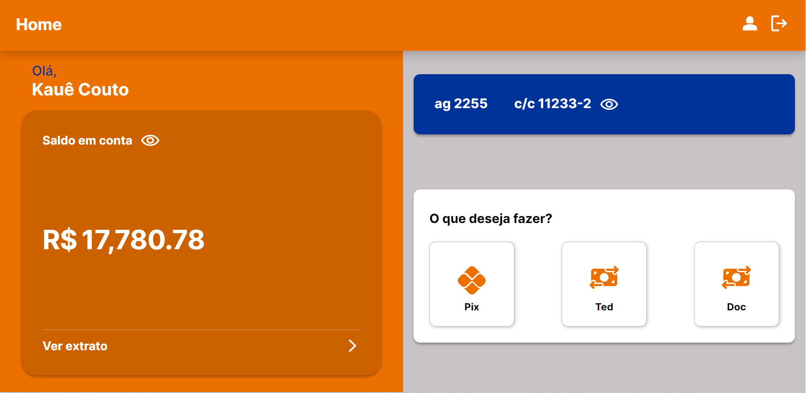

<h1>Teste-Estágio-Canais</h1>

# 📌 Tópicos

<!--ts-->

- [Descricao](#-Descricao)
- [Tecnologias](#-Tecnologias)
- [Tarefas](#-Features)
- [Aplicacao](#-Como-Posso-Rodar-a-Aplicacao?)
  
  <!--te-->

# 📄 Descricao

> A aplicação tem como objetivo principal realizar transferências bancárias como pix, ted e doc.

# Tecnologias

- [HTML](https://developer.mozilla.org/en-US/docs/Web/HTML)
- [CSS](https://developer.mozilla.org/pt-BR/docs/Web/CSS)
- [TypeScript](https://www.typescriptlang.org)
- [AngularV14](https://angular.io/)
- [Visual Studio Code](https://code.visualstudio.com/)
- [Karma Test: Jasmine](https://jasmine.github.io/)

# 🎯 Features

<pre>
 ✅ Login/Registro com uso de formulário e validação
 ✅ Transferências
 ✅ Extrato
</pre>

# 📑 Como Posso Rodar a Aplicacao?

<h3 style='color: orange'>Executar o projeto e acessar ambiente de desenvolvimento:</h3>
 

<pre>ng serve
</pre>
(disponibilizado em: http://localhost:4200/)

  

Rodar testes

<pre>ng test</pre>
 

